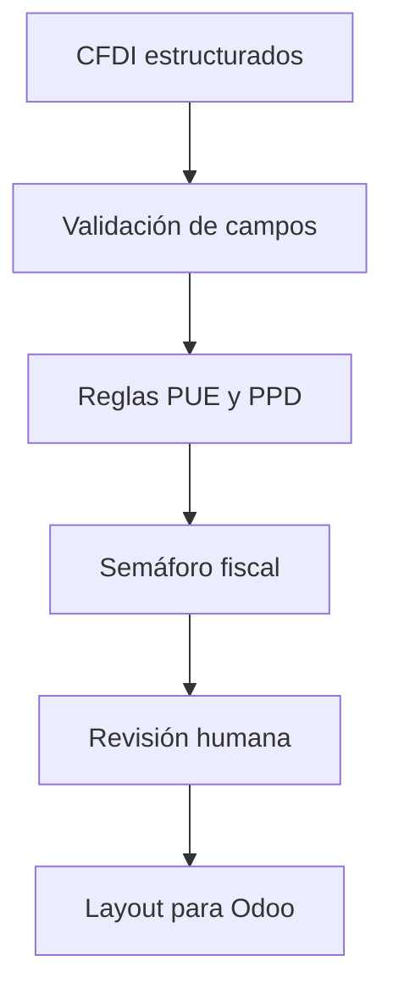

# FV® Tax Engine | IA Fiscal para Odoo

Prototipo de validación fiscal y operativa para CFDI mexicanos, diseñado para convertir datos extraídos de XML en alertas accionables, semáforos de control y layouts trazables para Odoo 18.

**Autor:** L.C.P. José Francisco Villaseñor Zúñiga (FV®)  
**Build Week:** OpenAI Build Week 2026

## Problema

La revisión manual de CFDI consume tiempo y permite inconsistencias entre el comprobante, el método de pago, la forma de pago, los complementos y el registro contable. FV® Tax Engine aplica reglas repetibles para señalar excepciones antes de la carga o conciliación en Odoo.

## Qué demuestra este repositorio

- Lectura de una muestra anonimizada de CFDI previamente estructurados.
- Validación de campos mínimos: tipo, método, forma de pago, fecha, proveedor y UUID.
- Detección de `PUE` con forma de pago `99`.
- Detección de `PPD` sin complemento de pago relacionado.
- Clasificación por semáforo: verde, amarillo y rojo.
- Generación de un CSV de resultados listo para revisión operativa.

> Este repositorio contiene datos sintéticos. No incluye RFC, UUID, credenciales ni información contable real.

## Uso de Codex y GPT-5.6

### Codex

Codex se utilizó como agente de construcción y control de calidad para:

1. Traducir la metodología fiscal FV® a reglas verificables.
2. Diseñar la estructura del prototipo y del repositorio.
3. Implementar el motor de semáforos en Python.
4. Crear casos de prueba anonimizados.
5. Revisar consistencia, trazabilidad y protección de datos antes de publicar.

### GPT-5.6

GPT-5.6 se utilizó como capa de razonamiento colaborativo para:

1. Convertir criterios fiscales y operativos expresados en lenguaje natural en reglas estructuradas.
2. Analizar excepciones de CFDI y priorizar hallazgos según riesgo.
3. Diseñar explicaciones claras para usuarios financieros no técnicos.
4. Apoyar la documentación de la metodología y su integración conceptual con Odoo 18.

La IA no sustituye el juicio profesional del contador. Las reglas y resultados requieren validación humana antes de cualquier registro contable o determinación fiscal.

## Flujo



## Ejecutar la demostración

Requiere Python 3.10 o superior y no utiliza dependencias externas.

```bash
python src/fv_tax_engine.py data/cfdi_demo.csv output/resultados_semaforo.csv
```

El resultado se genera en `output/resultados_semaforo.csv`.

## Reglas incluidas

| Regla | Resultado |
|---|---|
| Campos mínimos completos y combinación coherente | Verde |
| PPD con complemento pendiente | Amarillo |
| PUE con forma de pago 99 | Rojo |
| Campo obligatorio ausente | Rojo |

## Alcance y evolución

Esta versión es una demostración segura. La plataforma completa contempla extracción XML de encabezados y líneas, relación de complementos de pago, tipo de cambio por movimiento, papeles de trabajo de IVA/ISR, dashboards operativos y layouts controlados para Odoo.

## Aviso

Material demostrativo. No constituye asesoría fiscal ni reemplaza la revisión profesional o la normativa vigente aplicable.
