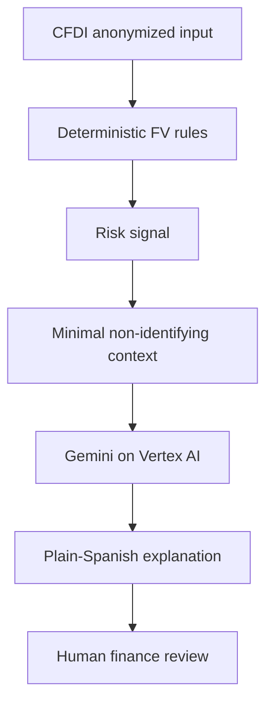

# FV® Fiscal Copilot — Build with Gemini XPRIZE

FV® Fiscal Copilot is an AI-native fiscal-operations assistant for Mexican small businesses. It combines deterministic CFDI validation rules with Gemini on Vertex AI to turn technical exceptions into clear, actionable review steps for finance and administration teams.

**Author:** L.C.P. José Francisco Villaseñor Zúñiga (FV®)  
**Competition:** Build with Gemini XPRIZE 2026  
**Primary category:** Small Business Services

## Problem

Mexican SMB finance teams routinely review CFDI data manually to detect inconsistencies between payment method, payment form, complements and accounting treatment. This work is repetitive, technical and prone to missed exceptions.

FV® Fiscal Copilot separates the workflow into two layers:

1. **Deterministic control layer:** applies repeatable CFDI operational rules.
2. **Gemini explanation layer:** translates each detected signal into concise Spanish, explaining what was detected, the operational risk and the next review action.

The AI does not replace the accountant, tax adviser or legal adviser. It helps prioritize and explain review work.

## Competition demo

The XPRIZE-specific implementation lives in [`xprize/`](./xprize/).

The demo:

- accepts an anonymized CFDI CSV;
- validates required operational fields;
- detects signals such as `PUE + forma de pago 99` and `PPD` without a related payment complement;
- classifies results using a green/yellow/red control signal;
- sends only a minimal non-identifying summary to Gemini through Vertex AI;
- returns a plain-Spanish explanation and recommended review action.

## AI-native workflow


```mermaid
flowchart TD
    A[CFDI anonymized input] --> B[Deterministic FV rules]
    B --> C[Risk signal]
    C --> D[Minimal non-identifying context]
    D --> E[Gemini on Vertex AI]
    E --> F[Plain-Spanish explanation]
    F --> G[Human finance review]
```

Gemini is part of the operating workflow rather than a decorative chatbot: it receives the structured result of the fiscal-control engine and converts that result into an explanation a finance manager can act on.

## Run the XPRIZE demo locally

```bash
pip install -r xprize/requirements.txt
export GOOGLE_CLOUD_PROJECT="YOUR_PROJECT_ID"
export GOOGLE_CLOUD_LOCATION="global"
streamlit run xprize/app.py
```

Use `cfdi_demo.csv` for the public demonstration. Do not upload taxpayer-identifying data to a public deployment.

## Cloud Run packaging

The repository includes an XPRIZE-specific `Dockerfile` suitable for Cloud Run deployment:

```bash
gcloud builds submit --tag REGION-docker.pkg.dev/PROJECT_ID/REPO/fv-fiscal-copilot -f xprize/Dockerfile .
```

See [`xprize/README.md`](./xprize/README.md) for the deployment and evidence checklist.

## Privacy by design

Only these fields are sent to Gemini in the demonstration workflow:

- CFDI type;
- payment method;
- payment form;
- whether a payment complement exists;
- control-light result;
- deterministic rule result.

RFCs, UUIDs, taxpayer names, credentials and real accounting data are excluded from the Gemini prompt.

## Pre-existing work disclosure

The deterministic CFDI rule engine predates this competition-specific branch and is reused as a generic technical component. The competition-specific work includes the AI-native operating workflow, Gemini/Vertex AI explanation layer, Streamlit interface, Cloud Run packaging, XPRIZE positioning and submission evidence.

This disclosure should also appear in the Devpost submission so judges can distinguish reused components from work created for the competition.

## Impact thesis

FV® Fiscal Copilot is designed to reduce manual fiscal-control effort for Mexican SMBs by making technical CFDI exceptions easier to detect, understand and route for human review. The intended outcome is faster exception handling, clearer finance-team decisions and fewer avoidable operational errors.

## Repository safety

This public repository uses synthetic/anonymized demonstration data. It contains no production credentials, taxpayer RFCs, real UUIDs or confidential accounting records.

## Disclaimer

Demonstration software. It does not constitute tax, accounting or legal advice and does not replace professional review or applicable regulation.
